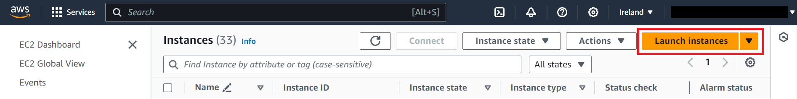
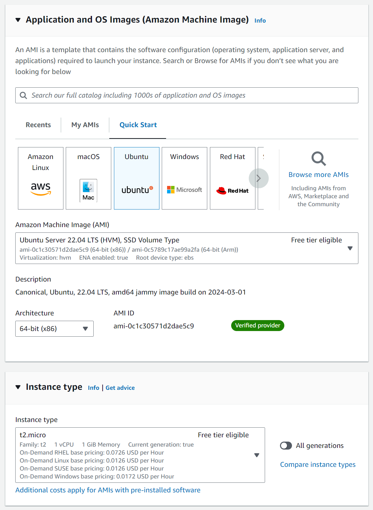

# AWS Notes

### Deploying a web application on AWS using EC2 (with Reverse Proxy)

Elastic Compute Cloud (EC2) is a service that allows you to create virtual machine/server instances.

#### Plan

1. Create an EC2 instance
2. Connect to the instance
3. Install node, git, and nginx
4. Edit the nginx configuration file to set up a reverse proxy
5. Clone the app repository
6. Run the app

#### Step 1: Create an EC2 instance

In the AWS console, go to the EC2 dashboard and click on the "Launch Instance" button.



Choose a suitable image and instance type.



Configure the network settings to allow HTTP traffic and give the security group a name if necessary.


Check the summary to make sure everything is correct and click "Launch instance".


When the instance has been created, click the underlined instance ID to go into the instance summary.


#### Step 2: Connect to the instance

Click "Refresh" until the "Connect" button is available and then click on it.


Go to the 'SSH client' tab and copy the command to connect to the instance in a terminal.

To do the final steps, you can either use the following script or run each command manually.

```bash
#!/bin/bash

sudo apt update -y
# non-interactive mode to avoid user input
sudo DEBIAN_FRONTEND=noninteractive apt-get upgrade -y

sudo apt install nginx -y

sudo sed -i "s|try_files .*;|proxy_pass http://127.0.0.1:3000;|g" /etc/nginx/sites-available/default

sudo systemctl restart nginx
sudo systemctl enable nginx

curl -fsSL https://deb.nodesource.com/setup_20.x | sudo -E bash - && sudo apt-get install -y nodejs

sudo apt install git -y

git clone https://github.com/developedbyluke/tech257-sparta-app.git repo

cd repo/app

sudo npm install

sudo npm install pm2 -g

pm2 start app.js
```
